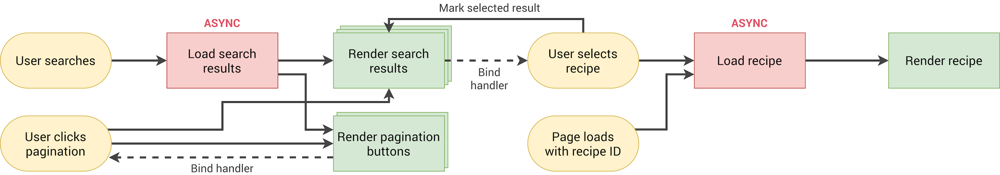

# Forkify Recipe Application

## Recipe application with custom recipe uploads

This web application is built using HTML5, CSS3, and advanced JavaScript concepts, incorporating asynchronous programming, ES6 modules, and object-oriented programming. Parcel and npm are utilized for production deployment.

## Features
**Recipe Search**: Easily search for your favorite recipes.
**View Details**: Get detailed information about each recipe.
**Bookmarking**: Save your favorite recipes for quick access.
**Add Personal Recipes**: Contribute and share your own culinary creations.
**Pagination**: Navigate through a large collection of recipes seamlessly.

## Technologies Used
HTML5
CSS3
JavaScript (ES6)
Asynchronous Programming
ES6 Modules
Object-Oriented Programming
Parcel
npm

### How to run
Prerequisites and dependencies:

$sudo apt install -y curl 

$curl -sL https://deb.nodesource.com/setup_18.x | sudo -E bash - 

$sudo apt install -y nodejs 

$node -v
v18.14.0

$npm -v
9.3.1

inside project root directory: 

npm init

npm i parcel@2.2.1 -D

to run: npm start

to build: npm run build

## Deployed Project
https://forkify-abk.netlify.app/
